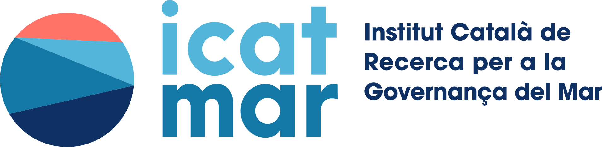
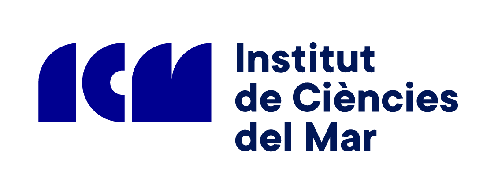

My main interests are the understanding of ocean turbulence and its role in Earth’s climate, with particular attention to the upper layers of the ocean between sub-mesoscales and mesoscales. My research combines theoretical developments with the analysis of ocean numerical models and ocean observations, such satellite data. Besides, I am also interested in a wide range of applied problems from the dispersion of fish larvae to operational oceanography.

